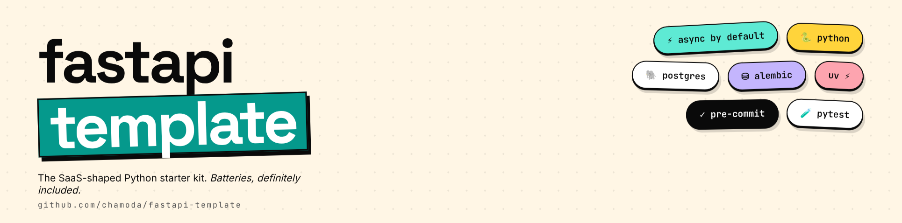

# fastapi-template

A SaaS-shaped Python starter kit built on FastAPI. Opinionated defaults so you can skip the wiring and start building.

## What's in the box

- **FastAPI** with a sub-app mount pattern (`/platform`) and per-app OpenAPI docs
- **Async-first** request path — SQLAlchemy 2.x async, `asyncpg`, `httpx`
- **Postgres 16** with **Alembic** migrations (autogenerate-friendly)
- **Auth** — `argon2-cffi` password hashing, JWT via `PyJWT`, secure cookies. Endpoints: `POST /auth` (login), `POST /logout`, `GET /users/me`
- **Pagination** via `fastapi-pagination`
- **Custom CLI** — `manage.py` powered by Typer
- **Tests** — `pytest`, `pytest-asyncio`, real Postgres in CI via `testcontainers`
- **Tooling** — `uv` for env & deps, `ruff` + `pyright` + `pre-commit`, GitHub Actions for CI

## Requirements

- Python 3.12
- Postgres 16
- [uv](https://docs.astral.sh/uv/)

## Quick start

Instructions assume Ubuntu 24.04.

```bash
git clone <repo-url> && cd fastapi-template
uv sync                                  # create venv + install deps (incl. dev group)
cp .env.example .env                     # then edit values
createdb fastapi_template                # or use psql / pgAdmin
uv run alembic upgrade head              # apply migrations
uv run pre-commit install                # set up git hooks
uv run fastapi dev                       # http://localhost:8000
```

Platform API docs: <http://localhost:8000/platform/docs>

## Common workflows

### Run the dev server
```bash
uv run fastapi dev
```

### Run tests
```bash
uv run pytest
```
Tests spin up Postgres in a container via `testcontainers` — no manual DB setup needed.

### Create a migration
```bash
uv run alembic revision --autogenerate -m "describe change"
uv run alembic upgrade head
```

### Run a custom management command
```bash
uv run python manage.py --help
```

### Lint & type-check
```bash
uv run pre-commit run --all-files
```
